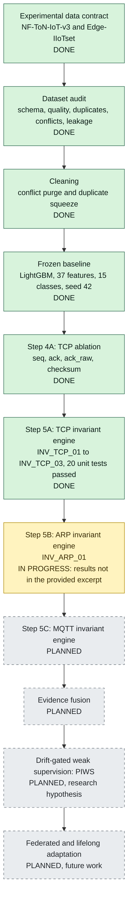
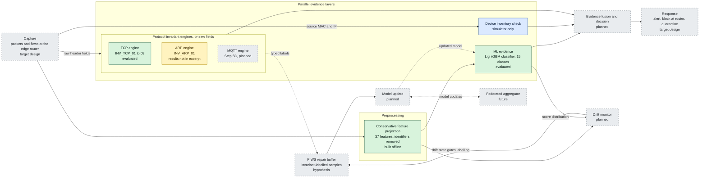
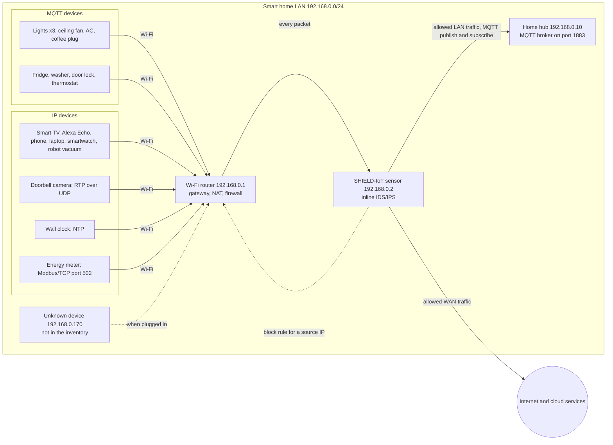
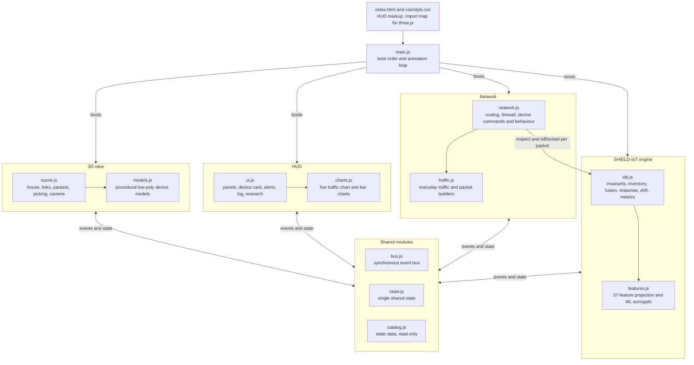
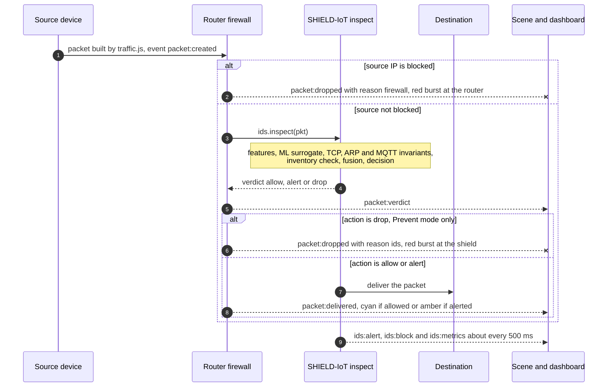

# SHIELD-IoT: architecture and research summary

**From dataset auditing to protocol-invariant, drift-aware IoT intrusion detection**

Author: Anirudh Sharma, NIT Hamirpur. Source: the *SHIELD-IoT Research Working Book* (October 2026).

> **About the source.** Every research number in this document is quoted from the book exactly as it appears there. Pages 4 and 5 of the book were missing from the copy this document was written from, so the **Step 5B (ARP) results** and the **Step 5C (MQTT) plan details** are unknown. Where the book is silent, this document says "not in the provided excerpt". Material about the browser simulator comes from its source code (`simulator/`) and is labelled as simulator-only. Text marked *reading* or *proposal* is this document's interpretation, not a book result.

**Status legend** used in the diagrams and tables:

| Status | Meaning |
|---|---|
| **Done** | Built and evaluated, with results reported in the book |
| **In progress** | Started; results are not in the provided excerpt |
| **Planned** | Named in the book as a later step; no results yet |
| **Simulator only** | Exists only in the browser simulator, not in the book's experiments |

## Contents

1. [Summary](#1-summary)
2. [Research pipeline](#2-research-pipeline)
3. [Target runtime architecture of the sensor](#3-target-runtime-architecture-of-the-sensor)
4. [Data contract and audit](#4-data-contract-and-audit)
5. [Cleaning and the frozen baseline](#5-cleaning-and-the-frozen-baseline)
6. [Step 4A: TCP ablation](#6-step-4a-tcp-ablation)
7. [Step 5A: TCP invariant engine](#7-step-5a-tcp-invariant-engine)
8. [Step 5B: ARP invariant engine](#8-step-5b-arp-invariant-engine)
9. [Step 5C: MQTT invariant engine (planned)](#9-step-5c-mqtt-invariant-engine-planned)
10. [Deployment view: a smart home](#10-deployment-view-a-smart-home)
11. [Simulator architecture: SHIELD-IoT Smart Home Lab](#11-simulator-architecture-shield-iot-smart-home-lab)
12. [Experimental checklist (Appendix B)](#12-experimental-checklist-appendix-b)
13. [Limitations and threats to validity](#13-limitations-and-threats-to-validity)
14. [Next steps](#14-next-steps)
15. [References and links](#15-references-and-links)

---

## 1. Summary

### The problem

The book states it directly: IoT/IIoT IDS models can score highly on fixed benchmarks yet fail under **distribution shift, unseen attacks, protocol manipulation and edge constraints**. A single benchmark score says little about how a detector behaves once it runs on a real network that changes over time.

### The SHIELD-IoT concept

SHIELD-IoT combines five kinds of evidence and adaptation instead of relying on one classifier:

1. **Probabilistic ML evidence**: a classifier trained on flow and packet features (the frozen LightGBM baseline).
2. **Deterministic protocol invariants**: rules that no valid TCP, ARP or MQTT traffic can break. A violation is hard evidence of malformed or manipulated traffic.
3. **Drift detection**: a monitor that notices when live traffic no longer looks like the training data.
4. **Controlled weak supervision**: using trusted evidence to label new data when the model needs repair.
5. **Later, federated/lifelong adaptation**: sharing model updates across sites over time.

### The PIWS hypothesis

**Protocol-Invariant Weak Supervision (PIWS)** proposes that typed protocol evidence (for example "this packet broke INV_TCP_02") could serve as a source of labels during drift repair, so the model can be updated without expensive manual labelling.

> **PIWS is a research hypothesis, not a result.** The book says so explicitly: "This remains a research hypothesis, not a proven result." Nothing in the provided excerpt evaluates it.

### Research gaps the project targets

| Gap | What it means |
|---|---|
| Label cost of drift adaptation | Repairing a drifted model normally needs fresh labels, which are expensive in IoT settings. |
| Cross-network generalization | A model trained on one network or dataset often does not transfer to another. |
| Single-layer evidence | Most IDS designs rely on one source of evidence (usually one ML model). |
| Federation without drift awareness | Federated learning schemes rarely account for drift at each site. |
| Unrealistic evaluation protocols | Random splits, duplicates and leaky identifiers inflate benchmark scores. |

### The research philosophy

The book's closing note summarises the method: *"audit the data, freeze the baseline, isolate protocol evidence, preserve negative findings, and integrate adaptation only after the evidence layers are characterized."* The value of the project is the **defensible chain of experiments**, not a single headline score.

---

## 2. Research pipeline

Each step builds on the previous one. Fusion, PIWS and federation come last on purpose: the book's checklist says to evaluate them "only then", after each evidence layer has been characterized on its own.

| # | Step | Status | Key output |
|---|---|---|---|
| 1 | Experimental data contract | Done | Two datasets fixed, with row counts, classes and known limitations (section 4) |
| 2 | Dataset audit (Edge-IIoTset) | Done | Quality, duplicate, conflict and leakage findings (section 4) |
| 3 | Cleaning | Done | Final clean pool 151,062 (section 5) |
| 4 | Frozen baseline | Done | LightGBM Macro F1 0.8872 (section 5) |
| 5 | Step 4A: TCP ablation | Done | Retain all four TCP fields (section 6) |
| 6 | Step 5A: TCP invariant engine | Done | Precision 1.0, recall 0.002793 on test (section 7) |
| 7 | Step 5B: ARP invariant engine | In progress | Rule INV_ARP_01 defined; results not in the provided excerpt (section 8) |
| 8 | Step 5C: MQTT invariant engine | Planned | Details not in the provided excerpt (section 9) |
| 9 | Evidence fusion | Planned | None yet |
| 10 | Drift-gated weak supervision (PIWS) | Planned | Hypothesis only |
| 11 | Federated/lifelong adaptation | Planned (future) | None yet |

Step 5B is marked "in progress" because its results sit on the missing pages. The book's title page says it consolidates "TCP and ARP invariant experiments", so the ARP experiment may well be complete; this document cannot confirm it.

---

## 3. Target runtime architecture of the sensor

This is the sensor SHIELD-IoT is working towards: a device that sits inline at the edge of an IoT network, inspects every packet, and combines several kinds of evidence before it acts.

### How the layers fit together

1. **Capture.** The sensor sees every packet at the edge router. The book does not describe a capture implementation; the excerpt's experiments run offline on dataset files.
2. **Preprocessing and the conservative feature projection.** Raw records become a 37-feature vector. The projection is *conservative* because the audit found leaky identifiers (an IP address that appears only in attack traffic, a class-associated `frame.time`). Identifiers are left out so the model cannot learn shortcuts. Preprocessing is **kept separate from the invariant engines** (Appendix B): invariants check raw protocol fields, so a cleaning or encoding choice can never create or hide an invariant violation.
3. **Parallel evidence layers.** Each layer judges the packet independently:
   - the **ML classifier** gives a probability over 15 classes (Normal plus 14 attack classes);
   - each **protocol invariant engine** returns typed violations (for example `INV_TCP_02`), or nothing;
   - in the simulator only, an **inventory check** flags any source MAC or IP that is not in the home's device inventory.
4. **Evidence fusion and decision.** The layers are combined into one verdict. The book lists fusion as a later step; its design is not in the provided excerpt. *Reading:* the Step 5A result ("asymmetric evidence") implies fusion should treat invariants asymmetrically: an invariant hit is strong evidence of an attack, but the absence of a hit says almost nothing (recall 0.002793).
5. **Response.** Alert the operator, block the source at the router firewall, or quarantine the device. This is the target design; the book reports no response experiments.
6. **Drift monitor, PIWS buffer and model update.** When the drift monitor reports that traffic has shifted, PIWS would collect samples labelled by invariant evidence and use them to update the model. This loop is the core research hypothesis and is untested.
7. **Federated aggregator (future).** Sites would share model updates instead of raw traffic.

### What is built and evaluated, and what is planned

| Component | Book status | In the simulator |
|---|---|---|
| Capture | Not described; experiments are offline | Simulated packets from a 3D smart home |
| Conservative feature projection (37 features) | **Done** (offline, on Edge-IIoTset) | Re-implemented on simulated packets (`features.js`) |
| ML classifier (LightGBM) | **Done**: frozen baseline evaluated | **Surrogate** only: hand-weighted, not the trained model |
| TCP invariant engine | **Done**: Step 5A evaluated, 20 unit tests passed | Implemented (`INV_TCP_01` to `03`) |
| ARP invariant engine | **In progress**: rule defined, results not in the provided excerpt | Implemented (`INV_ARP_01`) |
| MQTT invariant engine | **Planned** (Step 5C) | Experimental rules, off by default, not from the book |
| Inventory check | Not in the book | Implemented (always on) |
| Evidence fusion | **Planned** | Simple max-score fusion (a simulator choice) |
| Response: alert, block, quarantine | Not in the provided excerpt | Alerts and router blocks; no quarantine |
| Drift monitor | **Planned** | PSI monitor implemented |
| PIWS repair buffer | **Planned** (hypothesis) | Samples are queued and counted, never used for training |
| Model update | **Planned** | Not implemented |
| Federated aggregator | **Planned** (future) | Not implemented |

---

## 4. Data contract and audit

The data contract freezes which datasets are used and what is known about them before any model is trained.

### NF-ToN-IoT-v3

| Property | Value |
|---|---|
| Rows | 27,520,260 |
| Columns | 55 |
| Benign | 16,792,214 (~61.02%) |
| Attack | 10,728,046 (~38.98%) |
| Time span | 23–29 April 2019 |
| Nature | Flow metadata (NetFlow features) |
| Important limitation | Does not expose raw application payload syntax |

**Temporal structure.** Attack families are concentrated on particular days:

| Day (2019) | Traffic present |
|---|---|
| Apr 23 | scanning |
| Apr 24 | scanning + DoS |
| Apr 25 | DDoS + injection + DoS |
| Apr 26 | DDoS + password |
| Apr 27 | XSS + password |
| Apr 28 | backdoor + ransomware |
| Apr 29 | backdoor + MITM |

*Reading:* because each attack family appears only on certain days, a chronological split of NF-ToN-IoT-v3 would test a model on attacks it has not seen, which is closer to real drift than a random split. The provided excerpt reports no experiments on NF-ToN-IoT-v3. Because the dataset is flow metadata without payload, payload-level invariants (such as MQTT structure rules) cannot be checked on it.

### Edge-IIoTset

| Property | Finding |
|---|---|
| ML subset | 157,800 rows, 63 columns |
| DNN subset (current processing) | 2,219,201 rows |
| Classes | Normal plus 14 attack classes |
| Subset independence | ML and DNN subsets overlap heavily and are **not** independent train/test sets |
| Schema richness | TCP/UDP/ICMP, ARP, DNS, HTTP, MQTT and Modbus fields |

The 15 labels, as used in the simulator's catalog: Normal, Backdoor, DDoS_HTTP, DDoS_ICMP, DDoS_TCP, DDoS_UDP, Fingerprinting, MITM, Password, Port_Scanning, Ransomware, SQL_injection, Uploading, Vulnerability_scanner, XSS.

**Quality findings**

| Field or pattern | Problem |
|---|---|
| Zero values | Zeros often mean *not applicable* (the layer is absent), not a real zero |
| `tcp.srcport` | Contains hostnames in 367 MITM rows |
| `dns.qry.name.len` | Sometimes contains strings |
| `mqtt.conack.flags` | Formatting differences between records |

**Duplicates and conflicts**

| Subset | Exact duplicates | Conflicting labels after identifier removal |
|---|---|---|
| ML | 814 | 111 feature vectors / 3,593 records |
| DNN | 815 | 1,513 feature vectors / 8,972 records |

A *conflict* is a feature vector that appears with more than one label. Once identifiers are removed, the model cannot tell such records apart, so no classifier can get all of them right.

**Leakage risks**

| Risk | Finding |
|---|---|
| IP concentration | Severe. `192.168.0.170` appears in attack traffic without normal records, so a model that sees IP addresses can learn "this IP means attack". |
| `frame.time` | Structurally inconsistent and class-associated, so it can act as a label proxy. |

### Consequence

The book's decision: **use a conservative feature projection and explicit conflict/duplicate handling.** Identifiers and time fields are left out of the features, conflicting vectors are purged, and duplicates are squeezed out before the split.

---

## 5. Cleaning and the frozen baseline

### Cleaning (Edge-IIoTset ML subset)

| Step | Effect |
|---|---|
| Conflict purge | Removed 5,439 rows across 544 vectors |
| Duplicate squeeze | Removed 1,299 more rows |
| Final clean pool | 151,062 rows |

The numbers add up: 157,800 − 5,439 − 1,299 = 151,062. The purge removed more vectors (544) than the audit's 111 conflicting ML vectors. The excerpt does not explain the difference; one plausible cause is that the purge ran on the reduced 37-feature projection, where more records collide.

### Frozen split

| Property | Value |
|---|---|
| Train | 120,849 |
| Test | 30,213 (about 20% of the pool) |
| Features | 37 |
| Classes | 15 |
| Seed | 42 |
| Train/test overlap | Zero exact feature-vector overlap |

The split is **frozen**: Appendix B says never to regenerate it, so every later experiment (4A, 5A, 5B and so on) is measured against the same test set.

### LightGBM baseline

| Metric | Value |
|---|---|
| Accuracy | 0.8890 |
| Macro F1 | 0.8872 |
| Weighted F1 | 0.8898 |
| Macro Precision | 0.9050 |
| Macro Recall | 0.8780 |
| ROC-AUC | 0.9926 |
| PR-AUC | 0.9320 |
| Training time | 34.79 s |
| Latency | 35.15 μs/sample |

The hardware and batch conditions behind the training time and latency are not in the provided excerpt.

### Weakest classes

| Class | F1 |
|---|---|
| DDoS_HTTP | 0.72 |
| Uploading | 0.71 |
| SQL injection | 0.77 |
| Password / Fingerprinting | 0.80 |

The book notes that **DDoS_HTTP is a major confusion cluster**.

### Interpretation notes

- **ROC-AUC is discrimination, not calibration.** An ROC-AUC of 0.9926 means the model ranks attacks above normal traffic well. It does not mean a predicted probability of 0.9 is right 90% of the time. Any fusion rule that thresholds probabilities needs a separate calibration check.
- **MITM F1 1.00 applies to retained support 71 only.** A perfect score on 71 samples is weak evidence. It should not be read as "MITM is solved".
- *Reading:* macro precision (0.9050) is higher than macro recall (0.8780), so, averaged over classes, the classifier misses members of a class more often than it wrongly assigns that class.

---

## 6. Step 4A: TCP ablation

**Question.** Are the raw TCP fields (`seq`, `ack`, `ack_raw`, `checksum`) genuine signal, or leakage that should be dropped? Each field set was removed in turn and Macro F1 was measured on the frozen test set.

| Features dropped | Macro F1 | Change vs baseline (computed) |
|---|---|---|
| None (baseline) | 0.8872 | — |
| checksum | 0.8913 | +0.0041 |
| seq | 0.8737 | −0.0135 |
| ack_raw | 0.8576 | −0.0296 |
| ack_raw + checksum | 0.8685 | −0.0187 |
| ack | 0.8325 | −0.0547 |
| all four | 0.6282 | −0.2590 |

**Decision (book).** Sensitivity ranks **ack > ack_raw > seq > checksum**. **Retain all four.** Checksum is weaker and noisier (dropping it slightly raises F1) but it is **not established as leakage**.

*Reading:* removing all four fields costs far more (−0.2590) than any single removal, so the fields carry overlapping information. A field whose removal *raises* F1 (checksum) is a candidate for noise, but a small rise on one split is not proof. The book keeps it and records the finding instead of quietly dropping the feature, in line with "preserve negative findings".

---

## 7. Step 5A: TCP invariant engine

### Rules

| Rule | Invalid condition | Background (RFC 9293) |
|---|---|---|
| `INV_TCP_01` | SYN and FIN both set | SYN opens a connection and FIN closes one; a segment cannot sensibly do both |
| `INV_TCP_02` | flags = 0 with `tcp.len` > 0 | A segment with no control flags at all should not carry payload |
| `INV_TCP_03` | Initial SYN carries ACK | The first segment of a handshake has nothing to acknowledge |

### Results

| Rule | Train violations | Test violations |
|---|---|---|
| `INV_TCP_01` | 0 | 0 |
| `INV_TCP_02` | 286 | 71 |
| `INV_TCP_03` | 0 | 0 |

Test diagnostic for the engine as an attack detector:

| Metric | Value |
|---|---|
| Precision | 1.0 |
| Recall | 0.002793 |
| F1 | 0.00557 |
| Specificity | 1.0 |
| False positive rate | 0 |

Unit tests: **20 unit tests passed**.

### What it means

The book's verdict: **sparse, high-confidence, asymmetric evidence; not a standalone IDS.**

- **High confidence.** Precision 1.0 and FPR 0 on the test set: when the engine fires, it is right, and it never fired on Normal test traffic.
- **Sparse.** Recall 0.002793: it catches a tiny share of attacks. Only `INV_TCP_02` fired at all; `INV_TCP_01` and `INV_TCP_03` found nothing in Edge-IIoTset.
- **Asymmetric.** A hit is strong evidence of an attack; *no hit* is no evidence of benign traffic. *Reading:* a fusion rule should let an invariant hit raise suspicion but never let the absence of a hit lower it.
- *Reading:* **why it still matters for PIWS.** Labels that are rare but nearly always correct are exactly what weak supervision needs, provided enough of them appear during drift. Whether they do is the open question.
- The excerpt does not say which attack classes the 71 test hits belong to.

---

## 8. Step 5B: ARP invariant engine

### Rule

| Rule | Valid condition | Background (RFC 826) |
|---|---|---|
| `INV_ARP_01` | ARP opcode in {1,2} **and** hardware size = 6 | Opcode 1 is a request and 2 a reply; Ethernet hardware addresses are 6 bytes |

A record **violates** `INV_ARP_01` when the opcode is not 1 or 2, or the hardware size is not 6. Records without an ARP layer are *not applicable*, not violations: given the audit finding that zeros often mean not-applicable, a zero opcode on a non-ARP record must not count as invalid.

### Results

**Not in the provided excerpt.** Train/test violation counts, Normal false positives, precision, recall, coverage and the unit and regression tests for Step 5B were on the missing pages 4–5.

---

## 9. Step 5C: MQTT invariant engine (planned)

**Book status: planned.** The book's title page refers to "the planned MQTT Step 5C experiment". The rules, the encoding audit for MQTT fields and the evaluation plan are **not in the provided excerpt**.

Two book findings will shape it:

- the audit found **formatting differences in `mqtt.conack.flags`**, and Appendix B says to audit encodings before writing rules;
- NF-ToN-IoT is flow metadata without payload, so MQTT structure rules can be evaluated on Edge-IIoTset's MQTT fields but not on NF-ToN-IoT.

### Simulator only: experimental MQTT rules

> **These rules are not from the book.** They were written for the browser simulator from the MQTT specification, so that the MQTT switch in the dashboard has something to check. They are **off by default** and must not be cited as Step 5C.

| Simulator rule | Flags | Note |
|---|---|---|
| `INV_MQTT_01` | Reserved control packet type 0 or 15 | Type 15 is reserved in MQTT 3.1.1 but is AUTH in MQTT 5.0, so this rule assumes 3.1.1 |
| `INV_MQTT_02` | CONNECT with reserved flag bit 0 set | Reserved in both MQTT 3.1.1 and 5.0 |
| `INV_MQTT_03` | PUBLISH with QoS 3 | QoS 3 is malformed in both versions |

The simulator parses connect flags whether they arrive as integers or as hex, binary or decimal strings, as a nod to the `mqtt.conack.flags` formatting finding.

---

## 10. Deployment view: a smart home

The intended deployment is a home or small-office IoT network, with the sensor inline beside the router so every packet crosses it. The simulator models this home:

- **The router** is the default gateway; every packet crosses it. Its firewall enforces the blocks SHIELD-IoT requests.
- **The SHIELD-IoT sensor** sits inline right after the router, inspects each packet and returns a verdict (allow, alert or drop).
- **The hub** (a Raspberry Pi running Home Assistant and Mosquitto in the simulator) is the MQTT broker. Lights, fan, AC and appliances publish state to it and receive commands from it, so most in-home control traffic is MQTT.
- **The unknown device** uses `192.168.0.170`, the address the Edge-IIoTset audit found only in attack traffic. In the simulator its traffic is valid ARP and DNS; it is caught only because its MAC is not in the inventory.

*Deployment note (not from the book):* on real hardware, Wi-Fi client-to-client traffic (for example a bulb talking to the hub) stays inside the access point. To see it, the sensor must run on the router or access point itself or receive mirrored traffic. The simulator routes every packet through the sensor.

---

## 11. Simulator architecture: SHIELD-IoT Smart Home Lab

The **SHIELD-IoT Smart Home Lab** (`simulator/`) is a browser demonstration of the target architecture: a 3D night-time cut-away house whose 24 catalog entries (19 devices, 3 infrastructure boxes, the internet and one unregistered board) share one network, everyday traffic, and the SHIELD-IoT dashboard. It is plain ES modules with no build step; three.js 0.169.0 is loaded from a CDN through an import map.

### What the simulator is, and what it is not

- **The ML layer is a surrogate, not the trained LightGBM model.** `features.js` builds a 37-value feature vector per packet and scores it with a hand-weighted linear model and a softmax over the 15 Edge-IIoTset classes. It is tuned to behave like the book's baseline (for example, Uploading and DDoS_HTTP are confusable), but it was not trained on any dataset. Its probabilities are illustrative.
- **Ground truth is used only for the false-alarm counters.** Each packet carries a `label` (`Normal` or `Unregistered`). The IDS reads it only *after* the verdict, to count alerts or drops on normal traffic. A real sensor could not measure this live; the dashboard says so.
- **There is no attack launcher in this version.** Everyday traffic is protocol-valid, so the TCP, ARP and MQTT invariant engines report zero hits, which matches the book's finding that invariant evidence is sparse. The only intrusion scenario is the unknown device. Occasional ML alerts on normal traffic are possible and are counted as false alarms.
- **Latency figures in the dashboard are browser timings** of the simulated pipeline. They are not comparable with the book's 35.15 μs/sample.
- **Runs are reproducible.** Traffic and the surrogate use seeded PRNGs (the IDS uses seed 42, the baseline's seed).

### Module diagram

Each module talks to the others only through the shared `state` and the synchronous event `bus`, except that `network.js` calls the IDS directly for each packet. The binding interface is `simulator/CONTRACT.md`.

| Module | Role |
|---|---|
| `catalog.js` | Static data: floor plan, devices (IP, MAC, protocols, controls), the 15 classes, the book numbers quoted in the UI (`RESEARCH`), outside links (`RESOURCES`) |
| `state.js` | The single shared state; each field has one owning module that writes it |
| `bus.js` | Synchronous publish/subscribe event bus |
| `main.js` | Boots the modules and runs the animation loop; pausing sets simulation time to stand still |
| `network.js`, `traffic.js` | Benign traffic, routing through firewall and IDS, device commands and behaviour |
| `ids.js`, `features.js` | The SHIELD-IoT engine: features, ML surrogate, invariants, inventory, fusion, response, drift, metrics |
| `scene.js`, `models.js` | The three.js world, packet animation, device picking and the camera |
| `ui.js`, `charts.js`, `index.html`, `css/style.css` | Dashboard, device cards, alert feed, packet log, research and resources tabs |

### Packet flow

While the router reboots, LAN packets are dropped with reason `router-offline` and the IDS is not involved.

### Inside `ids.inspect`

1. **Preprocessing:** the 37-feature projection. IP addresses, MAC addresses and frame time are left out, following the leakage audit. Absent protocol layers stay `null`, never zero, so "not applicable" can never be read as "invalid".
2. **ML evidence:** the surrogate's top class and probability.
3. **Protocol invariants:** pure functions of the raw packet fields (`INV_TCP_01` to `03`, `INV_ARP_01`, and the experimental `INV_MQTT_01` to `03` when enabled), separate from preprocessing.
4. **Inventory check:** is the source MAC or LAN IP in the home inventory?
5. **Fusion and decision:** the score is the ML suspicion, raised to 0.99 by any invariant hit and to 0.9 for an unknown source. An invariant hit, or a score at or above the threshold (default 0.8), means drop in Prevent mode or alert in Detect mode. A lower score at or above max(0.5, threshold − 0.25) raises an alert.
6. **Response:** alerts from the same source and class within 3 s are merged. In Prevent mode, an invariant hit from a LAN source or an unregistered device is blocked at the router at once; ML-only alerts lead to a block after 5 alerts from one source within 10 s (adjustable from 1 to 20).
7. **Drift monitor:** the Population Stability Index (PSI) compares the recent mix of frame lengths, protocols and ML scores (last ~15 s) with a reference learned over the first ~30 s of simulation time. States: stable, warning (PSI 0.1 or more) and drift (above 0.25).
8. **PIWS buffer:** while the state is *drift*, packets with an invariant hit or an unknown source are queued as weakly labelled samples (up to 5,000). They are only counted; nothing is retrained. This illustrates the hypothesis and tests nothing.

All thresholds above are simulator settings, not values from the book.

**Safety rules in the response layer:** the router and the sensor can never be blocked. The hub and the internet are never blocked automatically, only by the operator. When the operator unblocks a source, it is not blocked automatically again until the simulation is reset.

### What a user can do

- **Control every device.** Pick a device in the Home network list or click it in the 3D view, then use its card: lights (power, brightness, colour), fan speed, AC temperature and mode, TV channel and volume, Alexa voice commands, door lock, washer programme, thermostat target, camera recording, vacuum, NTP sync, Modbus meter reads, router reboot. A command is real network traffic: usually an MQTT publish from the phone app to the hub, then hub to device, then a state update back; voice commands start at Alexa, and NTP syncs and meter reads produce NTP and Modbus/TCP exchanges.
- **Plug in an unknown device.** The *Plug in an unknown device* switch connects the unregistered board. It sends ARP and DNS from a MAC that is not in the inventory; SHIELD-IoT raises an alert and, in Prevent mode, blocks it at the router.
- **Toggle evidence layers.** Switch the ML surrogate, TCP invariants, ARP invariant, MQTT invariants (experimental, off by default) and the drift monitor on or off. The inventory check is always on. Each layer shows its hit count.
- **Switch Prevent or Detect.** Prevent drops and blocks; Detect only raises alerts.
- **Tune the response.** Adjust the ML threshold (0.5 to 0.99) and the number of alerts before an automatic block.
- **Block and unblock.** Block any device by hand from its card (except the router and the sensor), and lift blocks from the *Blocked at the router* list.
- **Watch drift.** The drift gauge shows the PSI, its state and the PIWS buffer size. Anything that changes the home's traffic mix, such as switching devices off or on, moves the PSI.
- **Inspect packets.** The packet log shows the last 200 packets with a protocol filter; clicking one shows its fields and the reasons for its verdict.
- **Read the research.** The Research tab shows the book's baseline, per-class F1, TCP ablation and invariant numbers; the Resources tab links to the datasets and standards.
- **Control time.** Pause, reset, and run at 0.5×, 1×, 2× or 4× speed.

---

## 12. Experimental checklist (Appendix B)

Status as of the provided excerpt:

- [x] **Freeze data contract.** Done: NF-ToN-IoT-v3 and Edge-IIoTset are fixed with sizes, classes and limitations (section 4).
- [x] **Audit leakage.** Done for Edge-IIoTset: IP concentration (`192.168.0.170`) and `frame.time` identified. The provided excerpt reports no equivalent audit for NF-ToN-IoT-v3.
- [ ] **Keep preprocessing separate from invariants.** A standing rule. The excerpt does not show how the experiments enforce it; the simulator follows it (invariants read raw packet fields, features live in a separate module).
- [x] **Never regenerate the baseline split.** In force: one frozen split (seed 42, zero exact feature-vector overlap) used by Steps 4A and 5A.
- [x] **Audit encodings before rules.** Done for Edge-IIoTset (hostnames in `tcp.srcport`, strings in `dns.qry.name.len`, `mqtt.conack.flags` formats). The MQTT-specific audit for Step 5C is not in the provided excerpt.
- [ ] **Distinguish not-applicable from invalid.** Identified in the audit (zeros often mean not-applicable). How Steps 5A and 5B apply it is not in the provided excerpt; the simulator uses `null` for absent layers.
- [ ] **Unit-test synthetic cases.** Partly done: 20 unit tests passed for Step 5A. Step 5B tests are not in the provided excerpt; Step 5C is not started.
- [ ] **Regression-test previous engines.** Not in the provided excerpt (the first opportunity is Step 5B re-running the Step 5A tests).
- [ ] **Report train/test rates, Normal FP, support, coverage and throughput.** Partly done: Step 5A reports train/test violation counts, precision, recall, specificity and FPR. Coverage and throughput for the invariant engine are not in the provided excerpt; Step 5B's report is on the missing pages.
- [ ] **Document deferred rules.** Not in the provided excerpt.
- [ ] **Only then evaluate fusion, drift-gated self-labelling and federation.** Not started, correctly: the evidence layers are not yet fully characterized.

---

## 13. Limitations and threats to validity

1. **NF-ToN-IoT is flow metadata without payload.** It cannot test payload-level invariants (for example MQTT packet structure), and per-packet TCP flag rules may only be approximated from flow fields. Cross-dataset claims will be limited to the features both datasets share.
2. **Edge-IIoTset ML and DNN subsets overlap heavily.** They are not independent train/test sets, so using one to validate a model trained on the other would overstate generalization.
3. **Single-dataset baseline.** All reported model results come from one frozen split of one dataset (the Edge-IIoTset ML subset). The cross-network generalization gap the project names is not yet measured.
4. **Residual label noise and leakage.** Conflicts were purged and identifiers removed, but other proxies may remain (for example, the checksum field's behaviour in Step 4A is noted as "weaker/noisier" without a final verdict).
5. **Small supports for some classes.** MITM's F1 of 1.00 rests on a retained support of 71.
6. **Sparse invariant recall.** The TCP engine's recall is 0.002793. Invariants cannot detect most attacks on their own, and PIWS will only work if enough invariant-labelled samples appear during drift, which is untested.
7. **Calibration is unmeasured.** ROC-AUC 0.9926 says nothing about whether the probabilities can be thresholded reliably in a fusion rule.
8. **PIWS is a hypothesis.** No experiment in the excerpt supports or refutes it.
9. **The simulator uses a surrogate model.** Its ML layer is hand-weighted, not the trained LightGBM; its traffic is synthetic; it has no attack launcher; its latency and false-alarm figures are properties of the simulation, not evidence for the research claims.
10. **Missing book pages.** Pages 4 and 5 were not available, so the Step 5B results and the Step 5C plan are absent from this document, and the status of both may be further along than shown here.

---

## 14. Next steps

From the book's sequence (Appendix B order):

1. **Finish and report Step 5B (ARP):** train/test violation rates, Normal false positives, support, coverage and throughput, plus the unit tests and a regression run of the Step 5A tests.
2. **Run Step 5C (MQTT):** audit MQTT field encodings first (including `mqtt.conack.flags`), separate not-applicable from invalid, write the rules, unit-test synthetic cases, regression-test the TCP and ARP engines, and document any deferred rules.
3. **Only then evaluate fusion**, drift-gated self-labelling (PIWS) and federation.

*Proposals (not from the book):*

4. **Fusion design:** make it asymmetric (invariant hits can raise suspicion, their absence never lowers it) and check probability calibration (for example with reliability curves) before thresholding ML scores.
5. **A drift protocol for PIWS:** use NF-ToN-IoT-v3's day-by-day attack structure as a chronological drift scenario, and measure how many invariant-labelled samples actually appear in each drift window, with and without the PIWS update.
6. **Cross-dataset evaluation** on the features the two datasets share, to quantify the generalization gap.
7. **Simulator:** add an attack launcher (SYN+FIN scans, flagless payload segments, malformed ARP, malformed MQTT) so the invariant engines can be seen firing, and replace the surrogate with the exported frozen LightGBM model.

---

## 15. References and links

**Datasets**

- Edge-IIoTset (IEEE DataPort): <https://ieee-dataport.org/documents/edge-iiotset-new-comprehensive-realistic-cyber-security-dataset-iot-and-iiot-applications>
- Edge-IIoTset (Kaggle mirror): <https://www.kaggle.com/datasets/mohamedamineferrag/edgeiiotset-cyber-security-dataset-of-iot-iiot>
- ToN-IoT datasets (UNSW Canberra), source of the NF-ToN-IoT flows: <https://research.unsw.edu.au/projects/toniot-datasets>
- NetFlow NIDS datasets (University of Queensland), NF-ToN-IoT-v3: <https://staff.itee.uq.edu.au/marius/NIDS_datasets/>

**Protocol standards**

- RFC 9293, Transmission Control Protocol (basis of INV_TCP_01 to 03): <https://www.rfc-editor.org/rfc/rfc9293>
- RFC 826, An Ethernet Address Resolution Protocol (basis of INV_ARP_01): <https://www.rfc-editor.org/rfc/rfc826>
- MQTT (protocol of the planned Step 5C): <https://mqtt.org/>
- MQTT Version 5.0 (OASIS standard): <https://docs.oasis-open.org/mqtt/mqtt/v5.0/mqtt-v5.0.html>
- RFC 5905, NTPv4 (simulator wall clock): <https://www.rfc-editor.org/rfc/rfc5905>
- Modbus specifications (simulator energy meter): <https://modbus.org/specs.php>

**Tools and guidance**

- LightGBM (baseline classifier): <https://lightgbm.readthedocs.io/>
- OWASP Internet of Things Project (IoT Top 10): <https://owasp.org/www-project-internet-of-things/>
- NIST IoT Cybersecurity Program (device baselines, NISTIR 8259): <https://www.nist.gov/itl/applied-cybersecurity/nist-cybersecurity-iot-program>
- three.js (3D engine of the simulator): <https://threejs.org/>

**In this repository**

- [README.md](README.md): how to run the simulator
- [simulator/CONTRACT.md](simulator/CONTRACT.md): the module contract of the simulator
